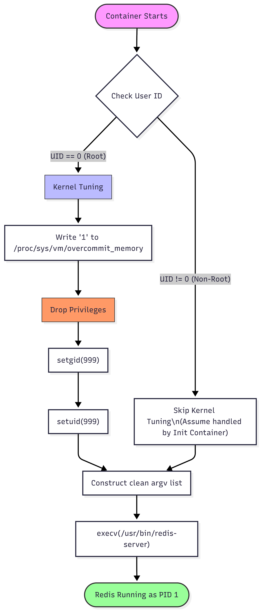

# 🔴 Ghost Core: Redis

### Ultra-Secure, Zero-Shell, Production-Ready Redis.


## 📖 Introduction

**Ghost Core Redis** is a re-engineered implementation of the Redis server, built from source on **Wolfi OS**. Unlike standard Docker images that rely on Debian/Alpine and include a shell (`/bin/sh`) for initialization, this image is **strictly Distroless**.

We strip away the package manager, the shell, and all non-essential binaries, leaving only the Redis executable and its runtime dependencies. This drastically reduces the attack surface and ensures a deterministic, immutable runtime environment.

---

## 🏗️ The Engineering Journey: Solving the "Zero-Shell" Paradox

Running Redis in a container seems simple, but doing it **securely without a shell** presents a complex operating system challenge known as the **"Privilege/Memory Paradox"**.

### 1. The Problem: `vm.overcommit_memory`
For Redis to ensure data persistence stability (background saving), the Linux kernel parameter `vm.overcommit_memory` must be set to `1`.
*   **The Constraint:** Modifying `/proc/sys/vm/overcommit_memory` requires **Root (UID 0)** privileges at startup.
*   **The Security Best Practice:** The actual Redis process should run as a **Non-Root User (UID 999)** to contain potential breakouts.

### 2. Why Official Images Don't Work for Us?
The official Redis image solves this by using a shell script (`docker-entrypoint.sh`) as the entrypoint. This script:
1.  Starts as Root.
2.  Echoes `1` to the kernel parameter file.
3.  Uses a tool like `gosu` to step down to the `redis` user.
4.  Executes the server.

**The Ghost Core Conflict:** Since our philosophy is **"Zero Shell"**, we removed `/bin/sh` and `bash` from the final image. We physically cannot run shell scripts or use `gosu`.

### 3. Our Solution: The `redis-init` C Wrapper
To overcome this without compromising on security or size, I engineered a custom, statically compiled **C program (`redis-init`)** that acts as the container's PID 1. This wrapper replicates the logic of complex shell scripts but with the speed and security of native code.

**How it intelligently handles permissions:**
*   **Context Awareness:** It checks its own User ID (`getuid()`) at startup.
*   **Self-Configuration (Docker Mode):** If it detects it is running as **Root**, it performs the kernel tuning (`fopen` -> write `1`), then executes secure system calls (`setgid` / `setuid`) to drop privileges to the unprivileged `redis` user before launching the server.
*   **Kubernetes Ready (Strict Mode):** If it detects it is already running as **Non-Root** (e.g., restricted via K8s SecurityContext), it skips the kernel modification step (assuming an `InitContainer` handled it) and launches Redis immediately.

### 4. Dynamic Linking Strategy
While we use a static C wrapper, the Redis binary itself utilizes **Dynamic Linking** for libraries like `openssl` and `zlib`.
*   **Why?** Static linking hides dependencies inside the binary, making them invisible to security scanners (like Trivy or Grype).
*   **The Fix:** By leveraging `pkg-config` within the Wolfi builder, we explicitly link against shared objects (`.so`). This ensures that vulnerability scanners can accurately detect and report the versions of libraries in use, providing full transparency in the SBOM (Software Bill of Materials).


## 🛠️ Deep Dive: The `redis-init` C Wrapper

Since we cannot use shell scripts (`.sh`) in a Distroless image, we had to reinvent the container initialization process. I wrote a custom C program (`src/redis-init.c`) to act as the container's **PID 1**.

This wasn't just about translating Bash to C; it was about handling Linux Kernel interactions safely.




### 1. Handling `vm.overcommit_memory` (The Root Problem)
Redis is very strict about memory management. It demands `vm.overcommit_memory = 1` to perform background saves (BGSAVE) without crashing.
*   **Challenge:** This is a kernel-level setting located at `/proc/sys/vm/overcommit_memory`. Only the `root` user can write to this file.
*   **Logic Implemented:**
    The C wrapper first checks `getuid()`. If it is `0` (Root), it attempts to open this file and write `1`.
    ```c
    FILE *f = fopen("/proc/sys/vm/overcommit_memory", "w");
    fprintf(f, "1"); // Enable overcommit
    ```
    This allows the container to self-configure when running in standard Docker environments.

### 2. Privilege Dropping (The Security Pivot)
Running the database as Root is a major security risk. After fixing the memory setting, we must immediately downgrade permissions.
*   **Mechanism:** The wrapper uses Linux System Calls directly:
    ```c
    setgid(999); // Switch Group to Redis
    setuid(999); // Switch User to Redis
    ```
    This ensures that by the time the actual Redis process starts, it has **zero** elevated privileges.

### 3. Argument Sanitization & Execution
A critical vulnerability in many wrappers is passing "dirty" arguments from the container runtime to the application.
*   **The Fix:** We do not blindly pass `argv` from the shell. We construct a clean argument array explicitly for the Redis binary.
    ```c
    char *new_argv[] = {
        "redis-server",      // Force argv[0] to be correct
        "/usr/local/etc/redis/redis.conf", // Enforce config path
        NULL
    };
    ```
*   **Process Replacement:** We use `execv()`. This replaces the `redis-init` process with `redis-server` in memory.
    *   **Why?** This ensures Redis becomes the new **PID 1**, allowing it to receive and handle system signals (like `SIGTERM` for graceful shutdowns) correctly.

> **[PLACEHOLDER: Diagram of redis-init Logic Flow]**
> *Visual Description: A decision tree showing: Start -> Am I Root? -> (Yes: Fix Memory -> Drop User) / (No: Skip) -> Construct Args -> Exec Redis.*

---

## ⚙️ Build Strategy (`build.sh`)

The build script for Redis is not a simple `make install`. It is a carefully orchestrated sequence designed to ensure **reproducibility** and **visibility**.

### 1. Static vs. Dynamic Linking (The Hybrid Approach)
We made a deliberate architectural decision to use a **Hybrid Linking Strategy**:
*   **The `redis-init` Wrapper:** Compiled **Statically** (`gcc -static`).
    *   *Reason:* This binary must run *before* anything else, and we want it to be completely self-contained with zero external dependencies to avoid any library loading issues during the boot phase.
*   **The `redis-server` Binary:** Compiled **Dynamically** (using `libc` malloc).
    *   *Reason:* We link dynamically against system libraries like `libssl` and `libcrypto`. This allows container security scanners to inspect the `/usr/lib` directory and accurately report the versions of OpenSSL being used (crucial for CVE patching).

### 2. Configuration Hardening
We don't trust the default `redis.conf`. During the build phase, we inject a hardened configuration file that:
*   Disables `protected-mode` (since we control access via container networking).
*   Forces logging to `stdout` (so `docker logs` works correctly).
*   Binds to `0.0.0.0` to be accessible within the pod network.


## 🔒 Security & Supply Chain Integrity

We treat the build process as a hostile environment where every byte must be verified.

*   **Cryptographic Verification:**
    Before any compilation begins, the Redis source tarball is downloaded and verified against a strict **SHA256 Checksum** defined in our `Taskfile`. If the upstream source is compromised or tampered with, the build pipeline halts immediately.
*   **Non-Root Architecture:**
    The final image is designed to run as `uid:999` (redis). Even if the container starts as root (for kernel tuning), it drops privileges within milliseconds.
*   **Read-Only Root Filesystem Ready:**
    The image structure is designed to support `readOnlyRootFilesystem: true` in Kubernetes. We have carefully separated writable paths (`/data`, `/tmp`, `/var/run`) from the immutable system paths.

---

## 💾 Usage: Data & Configuration (Mount Points)

Since this image is Distroless, you cannot just "exec in and edit files." You must mount your configuration and data volumes correctly.

### 1. Persistent Data (`/data`)
*   **Path:** `/data`
*   **Purpose:** Stores `dump.rdb` and `appendonly.aof` files.
*   **Ownership:** This directory is owned by `redis (999:999)`.
*   **Docker Run:**
    ```bash
    docker run -v my-redis-data:/data ghost-core/redis:prod
    ```

### 2. Custom Configuration (`/usr/local/etc/redis/redis.conf`)
*   **Path:** `/usr/local/etc/redis/redis.conf`
*   **Purpose:** The main configuration file.
*   **How to Override:** Mount your own config file here.
*   **Warning:** Ensure your custom config has `logfile ""` (empty string) to send logs to stdout, otherwise `docker logs` will be empty.
*   **Docker Run:**
    ```bash
    docker run -v $(pwd)/my-redis.conf:/usr/local/etc/redis/redis.conf ghost-core/redis:prod
    ```


---

### 3. Kubernetes Volume Mounts
When deploying to K8s, use a `ConfigMap` for the configuration and a `PersistentVolumeClaim` for data.

```yaml
volumeMounts:
  - name: redis-data
    mountPath: /data
  - name: redis-config
    mountPath: /usr/local/etc/redis/redis.conf
    subPath: redis.conf
```


## 🚀 Deployment Guide: Docker vs. Kubernetes

Because Redis needs to modify the host kernel (`vm.overcommit_memory`), the deployment strategy differs based on your platform.

### 1. Docker (Standalone)
In Docker, containers are often treated as "pet" instances. The easiest way to let Redis tune the kernel is to grant the container specific capabilities.

**The Command:**
```bash
docker run -d \
  --name ghost-redis \
  --cap-add SYS_ADMIN \
  --cap-add SYS_RESOURCE \
  -p 6379:6379 \
  ghost-core/redis:8.4.0-docker
```

**Why `--cap-add`?**
*   Our internal C wrapper (`redis-init`) starts as **Root**.
*   It tries to write to `/proc/sys/vm/overcommit_memory`.
*   Docker blocks write access to `/proc` by default. Giving `SYS_ADMIN` allows this specific write operation.
*   **After tuning, `redis-init` immediately drops privileges to User 999.**

> **Alternative (Manually tuning the host):**
> If you don't want to give capabilities to the container, run `sudo sysctl -w vm.overcommit_memory=1` on your host machine, then run the container normally without flags.

---

### 2. Kubernetes (Production / Secure)
In Kubernetes, giving `SYS_ADMIN` to a long-running pod is a security anti-pattern. Instead, we use the **Init Container Pattern** to separate the "Privileged Setup" from the "Secure Runtime".

**The Strategy:**
1.  **Init Container:** Runs as Root with privileges to tune the kernel. Dies immediately after.
2.  **Main Container (Redis):** Starts as User 999 (Non-Root) with **Zero Privileges**.

**`redis.yaml`:**
```yaml
apiVersion: apps/v1
kind: Deployment
metadata:
  name: ghost-redis
spec:
  replicas: 1
  template:
    spec:
      # -----------------------------------------------------------
      # 1. The "Privileged" Init Container (Runs once, then dies)
      # -----------------------------------------------------------
      initContainers:
      - name: tune-kernel
        image: busybox
        command: ['sh', '-c', 'sysctl -w vm.overcommit_memory=1']
        securityContext:
          privileged: true  # Necessary to modify node kernel settings
          runAsUser: 0

      # -----------------------------------------------------------
      # 2. The "Secure" Ghost Core Container (Long-running)
      # -----------------------------------------------------------
      containers:
      - name: redis
        image: ghost-core/redis:8.4.0-k8s
        ports:
        - containerPort: 6379
        securityContext:
          runAsUser: 999        # Explicitly Non-Root
          runAsGroup: 999
          allowPrivilegeEscalation: false # Block sudo/su
          capabilities:
            drop: ["ALL"]       # Drop all Linux capabilities
```
